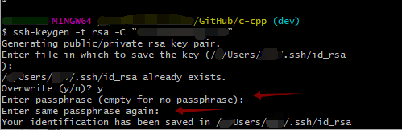
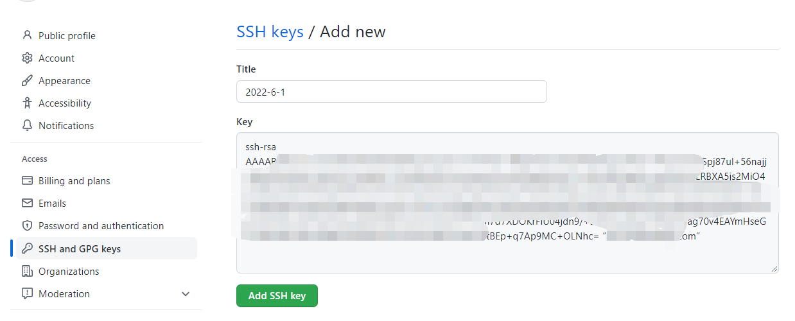
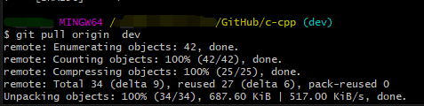

# Git Memorandum

## Common commands and methods

### 一、ssh连接取消每次密码验证

出现这种每次pull都要输入密码验证的


#### 1.重新配置密钥，注意不要输入密码！

执行

```git
ssh-keygen -t rsa -C ”yourEmail@emal.com”
```

Overwrite输入“y”，后面直接按回车，一定不要设置密码



#### 2.将新密钥复制到Github的SSH keys

执行

```
cat ~/.ssh/.ssh/id_rsa.pub
```


然后复制，并且在Github的SSH keys新建一个SSH keys把刚刚复制的填进去



#### 3.重新执行pull命令

不用输入密码了



#### 4.删除旧的Github的SSH keys

只保留一个Keygen


到此，成功把Git取消了每次pull和push都要输入密码验证


### 二、push冲突


### 三、dev分支执行pull origin main命令的补救 

（dev）变成了 (dev|MERGING)

### 四、Git 只修改首字母大小写进行重命名失败
先重命名成其他名字，再修改回来。
例如
```
git mv test Test
报错： 
"Rename from 'test' to 'Test/test' failed. Should I try again? (y/n)"
可以先：
git mv test Test_
再：
git mv Test_ Test

```

通过这样来修改，达到只改变首字母的重命名的效果。
